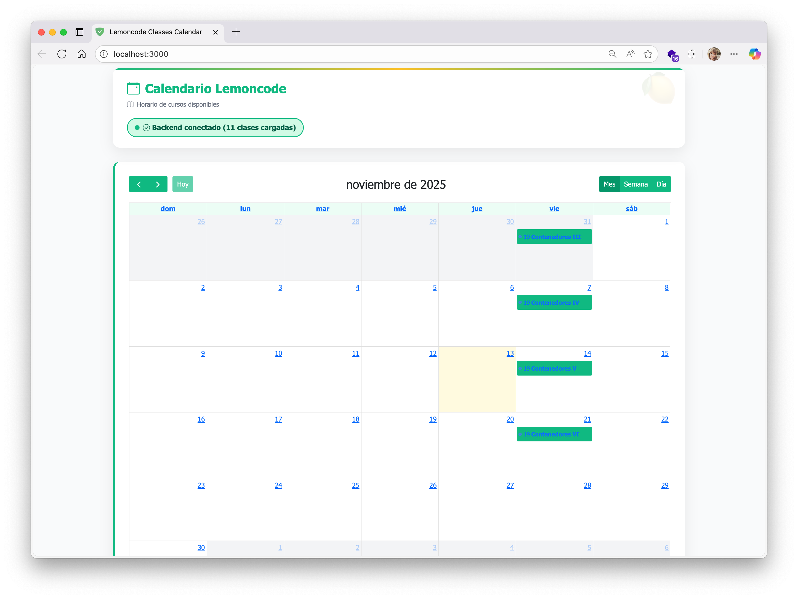
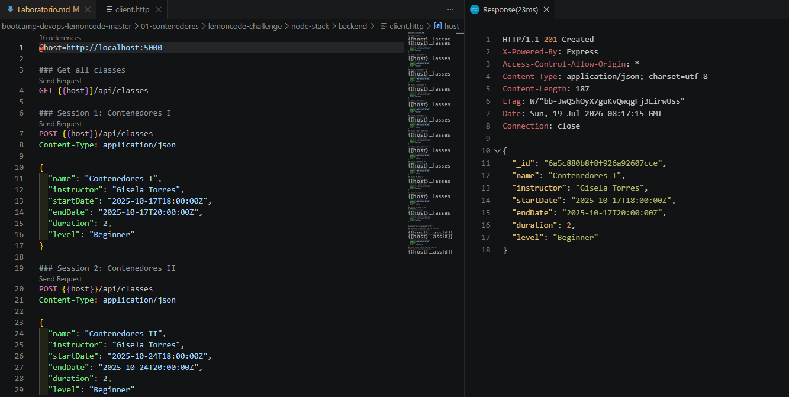
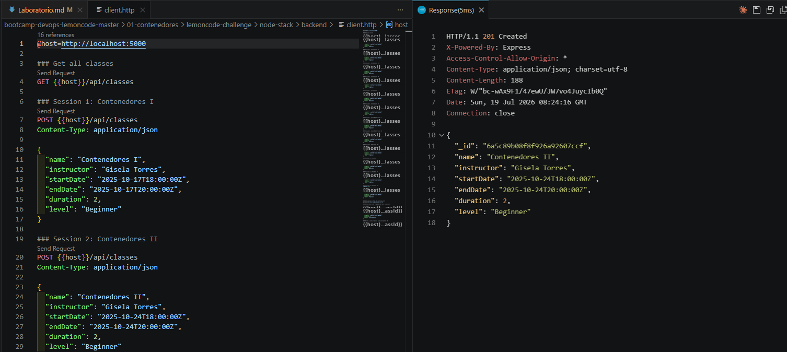
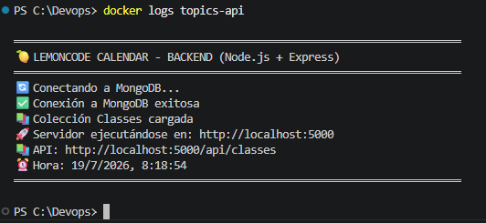
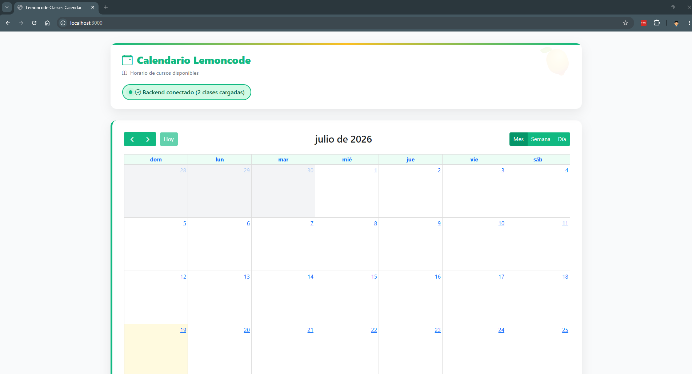
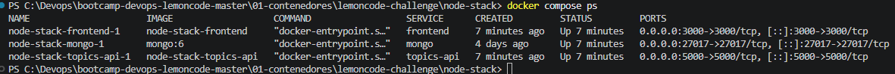
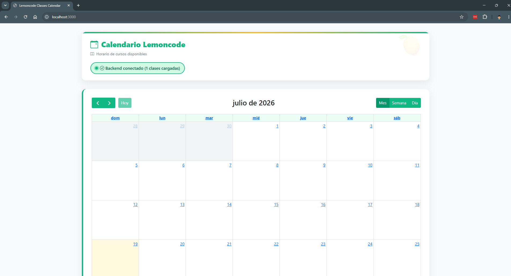

# 🐳 Laboratorio Contenedores - Retos del final del módulo 🕵🏻‍♀️🫆

## 🎯 Los 4 Retos
El objetivo es tener esta aplicación funcionando completamente en contenedores, la cual es un calendario de las clases de Lemoncode 🍋🗓️

La misma aplicación está disponible en dos stacks tecnológicos diferentes para el backend: .NET y Node.js. El frontend es idéntico en ambos casos. ¡Tú eliges cuál usar!

Está compuesta de tres componentes principales:

- 🌐 Frontend: Una interfaz con Node.js
- ⚙️ Backend: Elige tu aventura - .NET (dotnet-stack) o Node.js (node-stack) que se conecta con MongoDB **(Elección -> Node.js)**
- 🗄️ Base de datos: MongoDB para almacenar toda la información

## 🔥 Reto 1: MongoDB en Contenedor
Objetivo: Ejecutar MongoDB dentro de un contenedor y conectar el backend (ejecutándose localmente) para que pueda recuperar, crear, modificar y eliminar clases de la base de datos.

### 📋 Requisitos:
- Crear una red Docker para la comunicación
- Ejecutar MongoDB en un contenedor con persistencia de datos
- Ejecutar el backend localmente conectándose a tu nuevo MongoDB
- Verificar que el CRUD funciona correctamente usando la extensión REST Client y el archivo backend/client.http del stack que hayas elegido
- ✨ Puedes instalar la extensión de MongoDB for VS Code o usar MongoDB Compass para verificar que los datos se almacenan correctamente

¡Perfecto! Si has llegado hasta aquí, ya tienes MongoDB corriendo en un contenedor y tu backend puede comunicarse con él. ¡Buen trabajo! 🎉

## 🐳 Reto 2: Dockerizar el Backend
Objetivo: Crear un Dockerfile para el backend y ejecutarlo en contenedor, conectado a MongoDB via red Docker.

### 📋 Requisitos:
- Crear un Dockerfile para el backend (para .NET para o Node.js)
- Construir la imagen del backend
- Ejecutar el backend en un contenedor en la red Docker que creaste en el Reto 1
- Verificar que se conecta correctamente a MongoDB
- Exponerse el puerto 5000 para que sea accesible

💡 Tips:
Define variables de entorno adecuadas para la conexión a MongoDB
Asegúrate de que la imagen sea lo más eficiente posible
Usa puertos correctos (5000 para la API)

## 🎨 Reto 3: Dockerizar el Frontend
Objetivo: Crear un Dockerfile para el frontend y ejecutarlo en contenedor, conectado al backend via red Docker.

### 📋 Requisitos:
- Crear un Dockerfile para el frontend
- Construir la imagen del frontend
- Ejecutar el frontend en un contenedor en la red Docker
- Configurar las variables de entorno para conectarse al backend en http://topics-api:5000/api/classes
- Acceder a la interfaz desde el navegador en el puerto 3000

💡 Tips:
El frontend debe ser accesible desde http://localhost:3000
Configura las variables de entorno para apuntar al backend correcto
A través de los terminales de ambos componentes, e incluso desde la propia web podrás verificar que todo funciona correctamente

## 🎪 Reto 4: Docker Compose - Todo Junto
Objetivo: Usar Docker Compose para orquestar todos los servicios (MongoDB, Backend, Frontend) como un director de orquesta.

### 📋 Requisitos:
- Crear un compose.yml que incluya los tres servicios
- Configurar la red compartida lemoncode-network
- Definir volumen para persistencia de MongoDB
- Establecer todas las variables de entorno necesarias
- Exponer los puertos correctos (3000 para frontend, 5000 para API, 27017 para MongoDB)
- Definir dependencias entre servicios
- Levantar toda la aplicación con un único comando
- Acceder a la aplicación desde el navegador en http://localhost:3000

💡 Tips:
Usa depends_on para ordenar el inicio de los servicios
Mapea el volumen para persistencia de datos
Define claramente las variables de entorno para cada servicio
Documenta los comandos útiles (up, down, logs, etc.)

## Entregables

### 📦 Reto 1: MongoDB en Contenedor
- Comandos utilizados para crear la red Docker
- Comando para ejecutar el contenedor de MongoDB
- Configuración de conexión del backend a MongoDB
- Prueba REST Client mostrando peticiones exitosas (backend/client.http)

Solución

```bash
docker network create lemoncode-network

docker run -d \
  --name mongo \
  --network lemoncode-network \
  -p 27017:27017 \
  -v mongo-data:/data/db \
  mongo:6
```

El volumen es para que no se pierdan los datos si borro el contenedor.

`node-stack/backend/.env`:
```
DATABASE_URL=mongodb://localhost:27017
DATABASE_NAME=ClassesDb
PORT=5000
HOST=0.0.0.0
```

`localhost` porque el backend todavía corre en mi máquina, no en un contenedor.

```bash
cd node-stack/backend
npm install
npm start
```

Arranca bien, conecta a Mongo. Probé el CRUD con `client.http` (tuve que corregirlo, tenía el host en `5001` y el backend corre en `5000`): GET, POST, GET por id, PUT y DELETE, todo ok.



### 🐳 Reto 2: Dockerizar el Backend
- Archivo Dockerfile del backend
- Comando para construir la imagen
- Comando para ejecutar el contenedor del backend
- Prueba REST Client validando que la API responde correctamente

Solución

`node-stack/backend/Dockerfile`:
```dockerfile
FROM node:18-alpine
WORKDIR /app
COPY package*.json ./
RUN npm ci --only=production
COPY . .
EXPOSE 5000
CMD ["node", "app.js"]
```

Copio primero el `package.json` para que `npm ci` no se repita en cada build si solo cambia código.

```bash
docker build -t topics-api ./node-stack/backend

docker run -d \
  --name topics-api \
  --network lemoncode-network \
  -p 5000:5000 \
  -e DATABASE_URL=mongodb://mongo:27017 \
  -e DATABASE_NAME=ClassesDb \
  -e PORT=5000 \
  topics-api
```

Ahora `DATABASE_URL` apunta a `mongo` (nombre del contenedor) en vez de `localhost`, porque el backend ya corre dentro de la red. `docker logs topics-api` confirma la conexión, y `GET http://localhost:5000/api/classes` responde `[]` (borré el dato de prueba del Reto 1 con el DELETE).




### 🎨 Reto 3: Dockerizar el Frontend
- Archivo Dockerfile del frontend
- Comando para construir la imagen del frontend
- Comando para ejecutar el contenedor del frontend
- Archivo .env o variables de entorno configuradas correctamente

Solución

`node-stack/frontend/Dockerfile`, mismo patrón que el backend:
```dockerfile
FROM node:18-alpine
WORKDIR /app
COPY package*.json ./
RUN npm ci
COPY . .
EXPOSE 3000
CMD ["npm", "start"]
```

`node-stack/frontend/.env`:
```
API_URL=http://topics-api:5000/api/classes
```

```bash
docker build -t lemoncode-frontend ./node-stack/frontend

docker run -d \
  --name lemoncode-frontend \
  --network lemoncode-network \
  -p 3000:3000 \
  -e API_URL=http://topics-api:5000/api/classes \
  lemoncode-frontend
```

`API_URL` apunta a `topics-api` (nombre del contenedor) porque frontend y backend comparten red. `http://localhost:3000` responde 200, calendario cargado.



### 🎪 Reto 4: Docker Compose
- Archivo compose.yml completo y documentado con comentarios
- Archivo .env (si es necesario) con variables de entorno
- Comando docker-compose up ejecutándose exitosamente
- Captura de pantalla de todos los servicios corriendo (docker-compose ps)
- Captura de pantalla de la aplicación completa en http://localhost:3000

Solución

No hace falta `.env`, las variables ya están en `environment:` de cada servicio.

`node-stack/compose.yml`:
```yaml
services:
  mongo:
    image: mongo:6
    networks:
      - lemoncode-network
    volumes:
      - mongo-data:/data/db
    ports:
      - "27017:27017"

  topics-api:
    build: ./backend
    networks:
      - lemoncode-network
    ports:
      - "5000:5000"
    environment:
      - DATABASE_URL=mongodb://mongo:27017 # nombre del servicio, no localhost
      - DATABASE_NAME=ClassesDb
      - PORT=5000
    depends_on:
      - mongo

  frontend:
    build: ./frontend
    networks:
      - lemoncode-network
    ports:
      - "3000:3000"
    environment:
      - API_URL=http://topics-api:5000/api/classes
    depends_on:
      - topics-api

networks:
  lemoncode-network:

volumes:
  mongo-data:
```

Antes quité los contenedores de los retos 1-3 a mano para que no chocaran con los de Compose.

```bash
docker compose up -d --build
docker compose ps
```
```
NAME                      IMAGE                   SERVICE      STATUS
node-stack-frontend-1     node-stack-frontend     frontend     Up
node-stack-mongo-1        mongo:6                 mongo        Up
node-stack-topics-api-1   node-stack-topics-api   topics-api   Up
```

Probé la persistencia: creé una clase, hice `down` y `up -d` de nuevo, y seguía ahí (el volumen no se toca salvo con `down -v`).

`http://localhost:3000` responde 200.


